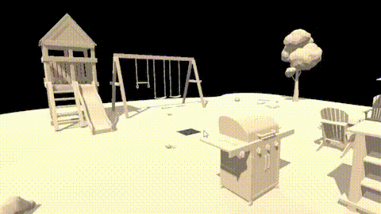
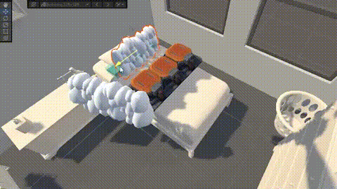
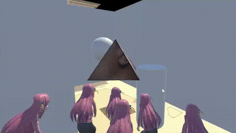

# GDARVR-Augmented Reality

<table>
    <tr>
        <td><b>Physics and Collisions</b></td>
        <td width="80%"></td>
    </tr>
    <tr>
        <td><b>Surface Detection</b></td>
        <td width="80%"></td>
    </tr>
    <tr>
        <td><b>Game vs AR World</b></td>
        <td width="80%"></td>
    </tr>
    <tr>
        <td><b>AR Markers</b></td>
        <td width="80%"></td>
    </tr>
</table>